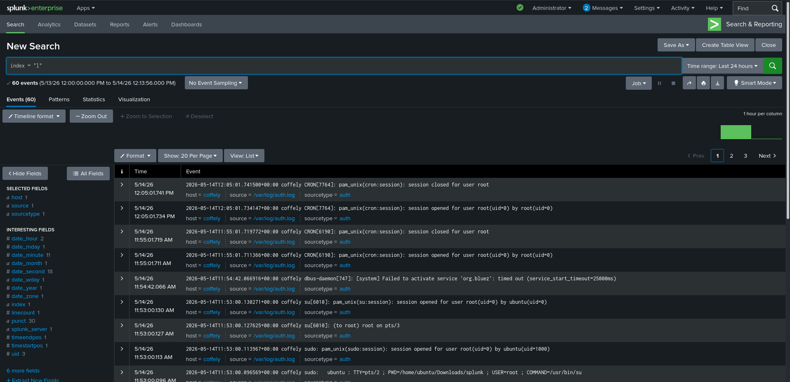
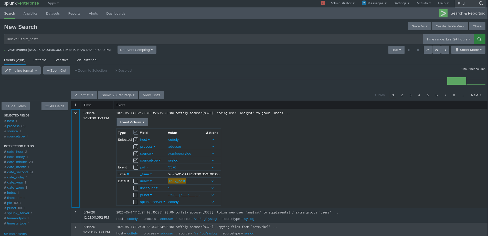
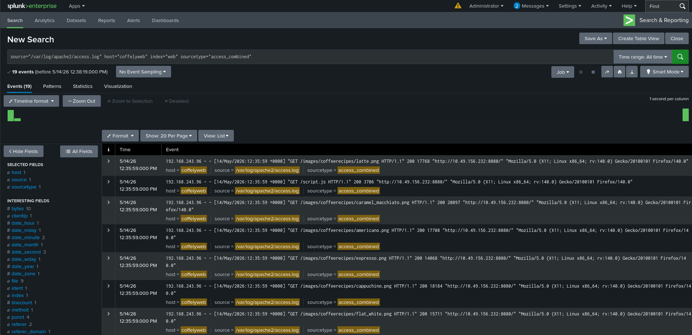
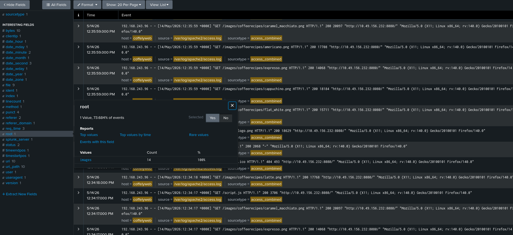
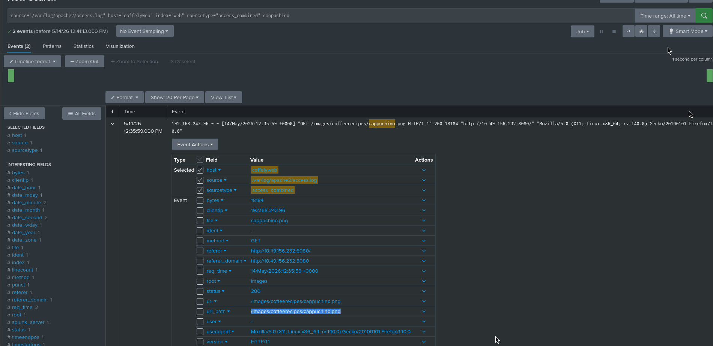
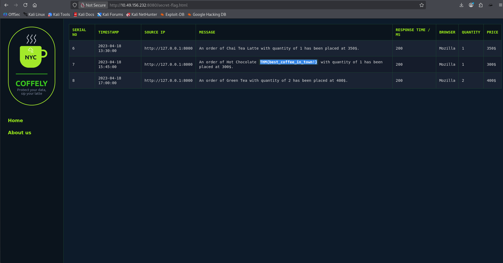

# Splunk: Setting Up a SOC Lab Walkthrough: Building a Mini SIEM with Splunk & Universal Forwarder

Security Operations Centers (SOCs) rely heavily on centralized logging and monitoring to detect suspicious activity, investigate incidents, and maintain visibility across infrastructure. In this hands-on lab, we’ll build a small SOC-style environment using Splunk, configure log forwarding, ingest Linux and Apache web logs, and perform some basic investigation.

This room focuses less on attack simulation and more on foundational blue-team engineering—setting up the telemetry pipeline that analysts depend on every day.

Lab: [TryHackMe Splunk Lab](https://tryhackme.com/room/splunklab?utm_source=chatgpt.com)

---

# Task 1: Introduction

This scenario revolves around Coffely, a coffee business that recently suffered an insider-related data breach involving the theft of a secret recipe. After resolving that incident, the next logical move is strengthening detection capabilities.

Instead of waiting for incidents to happen, the objective here is to build an internal monitoring setup capable of collecting logs from different systems and making them searchable from a single location.

By the end of this lab, we will:

* Install Splunk Enterprise on Linux
* Install and configure Splunk Universal Forwarder
* Ingest Linux system logs
* Forward Apache web logs
* Configure indexes and receiving ports
* Perform simple investigations using Splunk Search Processing Language (SPL)

This is essentially a beginner-friendly SOC engineering exercise.

---

# Task 2: Understanding Splunk Deployment Architecture

Before deploying anything, understanding how Splunk components interact is important.

A typical Splunk architecture consists of several moving parts.

## Forwarders

Forwarders are lightweight agents installed on endpoints or servers that collect logs and send them to Splunk.

Think of them as telemetry shippers.

Two common types exist:

* Universal Forwarder → lightweight, forwards raw data
* Heavy Forwarder → can parse/filter data before forwarding

In our lab, we’ll use the Universal Forwarder.

## Indexer

The indexer is where incoming logs are processed and stored.

Its responsibilities include:

* Receiving incoming data
* Parsing logs
* Transforming events
* Storing them in searchable indexes

This is effectively Splunk’s storage + ingestion engine.

Question:

Which part of the Splunk deployment architecture is responsible for processing incoming data from forwarders?

Answer:

```text
Indexer
```

## Search Head

This is what analysts actually interact with.

The search head allows:

* Running SPL queries
* Building dashboards
* Investigating events
* Creating alerts/reports

In this lab, the Search Head and Indexer live on the same machine.

In enterprise environments, these roles are usually separated.

## Deployment Server

Managing one forwarder manually is easy.

Managing hundreds? Not fun.

That’s where the deployment server helps.

It centrally manages:

* forwarder configs
* updates
* inputs
* outputs

Question:

Which Splunk feature helps manage hundreds of employee workstations remotely?

Answer:

```text
Deployment Server
```

---

# Task 3: Linux Deployment — Installing Splunk Enterprise

Now for the actual deployment.

We’ll install Splunk Enterprise on the Linux host and bring up the web interface.

The installer is already provided inside the lab environment, so no manual download is needed.

---

## Step 1: Navigate to Installer Directory

Move into the provided Splunk package location:

```bash
cd ~/Downloads/splunk
```

Check available files:

```bash
ls
```

Expected output:

```text
splunk_installer.tgz
splunkforwarder.tgz
```

This confirms both:

* Splunk Enterprise installer
* Universal Forwarder installer

are ready.

---

## Step 2: Switch to Root

Splunk gets installed under `/opt`, which requires elevated privileges.

```bash
sudo su
```

Why?

Because `/opt` is generally used for optional or third-party software installations on Linux.

---

## Step 3: Extract Splunk Enterprise

Run:

```bash
tar xvzf splunk_installer.tgz -C /opt
```

### What this does

Breaking the command down:

* `tar` → archive utility
* `x` → extract
* `v` → verbose output
* `z` → gzip compressed archive
* `f` → target file
* `-C /opt` → extract directly into `/opt`

This installs Splunk binaries into:

```text
/opt/splunk
```

---

Question:

In which Linux directory should Splunk typically be installed?

Answer:

```text
/opt
```

---

## Step 4: Start Splunk

Move into the binaries directory:

```bash
cd /opt/splunk/bin
```

Start Splunk:

```bash
./splunk start --accept-license
```

### Why `--accept-license`?

Because this is the first launch.

Without explicitly accepting the license, startup won’t continue.

Splunk will prompt for administrator credentials.

Example:

```text
Username: admin
Password: ********
```

Choose your own secure password.

---

## Step 5: Access the Web UI

Once startup completes, Splunk exposes its interface here:

```text
http://coffely:8000
```

Open browser inside VM.

Login using the credentials you just created.

---

Question:

Which port does Splunk web run on by default?

Answer:

```text
8000
```

---

# Task 4: Managing Splunk from CLI

SOC engineers frequently manage Splunk from terminal instead of relying only on the GUI.

Knowing CLI basics saves time.

All commands are run from:

```bash
/opt/splunk/bin
```

---

## Start Splunk

```bash
./splunk start
```

Starts all required Splunk services.

If already running, this won’t change anything.

---

## Stop Splunk

```bash
./splunk stop
```

Gracefully shuts down the instance.

Useful during maintenance.

---

## Restart Splunk

```bash
./splunk restart
```

Use this after configuration changes.

Equivalent mindset:

*"changed config → restart service"*

---

## Check Status

```bash
./splunk status
```

Example:

```text
splunkd is running
```

This confirms the service state.

---

## One-shot Log Ingestion

You can ingest a single file manually:

```bash
./splunk add oneshot /path/to/logfile -index yourindex
```

Useful for:

* quick testing
* importing a single forensic artifact
* validating parsing behavior

Unlike monitoring, this does **not** continuously watch the file.

---

## Searching via CLI

Search for a term:

```bash
./splunk search coffely
```

This queries indexed events containing:

```text
coffely
```

Handy when you want fast verification without opening the GUI.

---

Question:

Search Splunk for the term `coffely`.

Answer:

```bash
./splunk search coffely
```

---

## CLI Help

Need syntax help?

```bash
./splunk help
```

For specific commands:

```bash
./splunk help search
```

This provides command-specific usage details.

---

Question:

Which command gives help for Splunk searches?

Answer:

```bash
./splunk help search
```

---

## Why This Matters

GUI workflows are comfortable.

CLI workflows are faster.

In real environments, especially during incident response, terminal familiarity matters a lot.

---

# Task 5: Installing Splunk Universal Forwarder

So far, we’ve deployed the Splunk server itself.

Now we need a mechanism to actually *ship logs* from endpoints into that server.

That’s where the Splunk Universal Forwarder comes in.

Think of it as a lightweight log courier—it watches selected files/events and forwards them to the indexer.

In production, this usually runs on separate endpoints.

For lab simplicity, both Splunk Enterprise and the forwarder run on the same machine.

---

## Step 1: Return to Installer Directory

Move back:

```bash
cd ~/Downloads/splunk
```

Check available files:

```bash
ls
```

Expected:

```text
splunk_installer.tgz
splunkforwarder.tgz
```

The file we care about now:

```text
splunkforwarder.tgz
```

---

## Step 2: Extract the Universal Forwarder

As root:

```bash
tar xvzf splunkforwarder.tgz -C /opt
```

This extracts the forwarder into:

```text
/opt/splunkforwarder
```

Same logic as earlier:

* `x` → extract
* `v` → verbose
* `z` → gzip archive
* `f` → file
* `-C /opt` → destination path

---

## Step 3: Start the Forwarder

Move into its binaries directory:

```bash
cd /opt/splunkforwarder/bin
```

Launch:

```bash
./splunk start --accept-license
```

Question:

Full command used?

Answer:

```bash
./splunk start --accept-license
```

---

## Port Conflict Explained

At first launch, you’ll hit something interesting.

Splunk Enterprise already uses:

```text
8089
```

That port handles Splunk management traffic (`splunkd`).

But the Universal Forwarder also wants the same default management port.

Result?

Collision.

Example:

```text
ERROR: mgmt port [8089] - port is already bound
```

Splunk asks:

```text
Would you like to change ports? [y/n]
```

Choose:

```text
y
```

Then enter:

```text
8090
```

Why this works:

* Splunk Enterprise → 8089
* Universal Forwarder → 8090

No overlap.

---

Question:

Default forwarder management port?

Answer:

```text
8089
```

---

# Task 6: Configuring the Forwarder & Ingesting Linux Logs

Forwarder installed ≠ useful.

Right now it’s running, but forwarding nothing.

We need to:

* configure receiving on Splunk
* create a destination index
* tell forwarder where to send logs
* specify which logs to monitor

This is where the telemetry pipeline becomes real.

---

# Step 1: Enable Receiving in Splunk

Inside the web UI:

Go to:

```text
Settings → Forwarding and receiving
```

Click:

```text
Receive data → Add new
```

Set port:

```text
9997
```

Why?

This is Splunk’s standard receiving port for forwarded data.

Meaning:

Forwarder → sends logs → Splunk listens here

Save it.

---

# Step 2: Create a Dedicated Index

Now create storage for Linux logs.

Go:

```text
Settings → Indexes
```

Click:

```text
New Index
```

Name:

```text
linux_host
```

Keep defaults.

Why create a custom index?

Because storing everything in:

```text
main
```

gets messy fast.

Segregated indexes improve:

* organization
* retention management
* search efficiency
* investigations

---

# Step 3: Add Forward Server

Now tell the forwarder where to send events.

From terminal:

```bash
./splunk add forward-server 10.48.147.244:9997
```

You’ll be prompted for credentials.

What this means:

* `10.48.147.244` → Splunk server IP
* `9997` → receiving port
* forwarder now knows destination

This establishes the pipeline.

---

# Step 4: Inspect Linux Logs

Most Linux logs live in:

```text
/var/log
```

Check:

```bash
ls /var/log
```

You’ll see files like:

```text
auth.log
syslog
kern.log
apache2/
```

Each useful for different investigations.

Examples:

* `auth.log` → authentication events
* `syslog` → general system activity
* `kern.log` → kernel events
* Apache logs → web traffic

---

# Step 5: Monitor syslog

Tell forwarder to continuously watch syslog:

```bash
./splunk add monitor /var/log/syslog -index linux_host
```

Meaning:

* monitor this file
* ingest every new line
* send to `linux_host`

Unlike oneshot ingestion, this is continuous.

---

# Step 6: Verify Configuration

Check generated config:

```bash
cat /opt/splunkforwarder/etc/apps/search/local/inputs.conf
```

Expected:

```ini
[monitor:///var/log/syslog]
disabled = false
index = linux_host
```

Interpretation:

* monitor active
* syslog watched
* destination index defined

---

# Step 7: Generate a Test Event

Linux provides:

```bash
logger
```

A simple utility that writes to syslog.

Generate test event:

```bash
logger "coffely-has-the-best-coffee-in-town"
```

Check local log:

```bash
tail -1 /var/log/syslog
```

Expected:

```text
coffely-has-the-best-coffee-in-town
```

This confirms event generation.

---

# Step 8: Search in Splunk

Query:

```spl
index=linux_host "coffely-has-the-best-coffee-in-town"
```

If the event appears:

pipeline works ✅

---

## Practical Exercise 1 — auth.log Ingestion

Now instead of syslog, ingest:

```text
/var/log/auth.log
```

Command:

```bash
./splunk add monitor /var/log/auth.log -index linux_host
```

This captures authentication-related events.

Examples:

* SSH logins
* failed authentication
* sudo usage
* account changes

---

Question:

Value of `sourcetype` field?

Answer:

```text
auth
```



---

## Practical Exercise 2 — User Creation Event

Create a test user:

```bash
adduser analyst
```

Why?

Creating users generates authentication/system events.

Perfect for verifying ingestion.

Now search in Splunk for relevant events.

Look at extracted fields.

If `process` isn’t visible:

```text
More Fields
```

Add it manually.

Question:

Value of `process` field?

Answer:

```text
adduser
```



---

## Why This Matters

This is real SOC engineering workflow.

Telemetry onboarding usually follows:

1. identify log source
2. configure ingestion
3. normalize data
4. validate visibility
5. build detections

Without telemetry, detection engineering is blind.

---

# Task 7: Windows Forwarding (Conceptual Walkthrough)

So far, we’ve onboarded Linux telemetry.

But real SOC environments rarely monitor just Linux.

A typical environment includes:

* Windows workstations
* Domain Controllers
* Web servers
* Firewalls
* VPN appliances
* Cloud telemetry

Centralized log aggregation becomes critical because isolated logs tell partial stories, while correlated logs reveal incidents.

Since this lab only provides one Linux VM, the Windows part is walkthrough-only—but the workflow mirrors production setups.

---

## Monitoring Windows Logs with Universal Forwarder

On a Windows machine, the Universal Forwarder would be installed similarly.

Then from PowerShell:

```powershell
cd "C:\Program Files\SplunkUniversalForwarder\bin"
```

Add Windows Security logs:

```powershell
.\splunk.exe add monitor C:\Windows\System32\winevt\Logs\Security.evtx
```

### What this does

This tells Splunk Forwarder to watch:

```text
Security.evtx
```

Which contains critical Windows security telemetry like:

* logon events
* failed logins
* privilege escalation
* account creation
* audit policy changes

For defenders, this is gold.

---

## Deployment Server for Central Management

Managing a handful of forwarders manually?

Fine.

Managing 500 endpoints?

Painful.

Splunk solves this via Deployment Server.

Enable it:

```bash
./splunk enable deploy-server
```

Then restart:

```bash
./splunk restart
```

This turns your Splunk instance into a centralized configuration manager.

Question:

Linux command to enable deployment server?

Answer:

```bash
./splunk enable deploy-server
```

---

## Why Deployment Server Matters

Instead of manually touching each machine, you can push:

* monitoring configs
* app deployments
* input definitions
* output settings

Think of it as configuration management for Splunk infrastructure.

---

# Task 8: Ingesting Apache Web Logs

Now we move into one of the most useful SOC data sources:

**Web server logs.**

The Coffely application is hosted locally via Apache.

Accessible at:

```text
http://coffely.thm:8080
```

Web logs help analysts investigate:

* suspicious requests
* brute-force attempts
* path enumeration
* exploit attempts
* user activity
* file access patterns

---

## Step 1: Locate Apache Logs

Apache access logs live at:

```text
/var/log/apache2/access.log
```

This file records incoming HTTP requests.

Typical fields include:

* client IP
* request method
* URI
* response code
* user agent
* timestamp

Perfect SOC telemetry.

---

## Step 2: Add Data via Splunk UI

Inside Splunk:

```text
Settings → Add Data
```

Choose:

```text
Monitor
```

Then:

```text
Files & Directories
```

Path:

```text
/var/log/apache2/access.log
```

Choose:

```text
Continuously Monitor
```

Why continuous monitoring?

Because web traffic keeps changing.

One-shot ingestion would only capture existing entries.

Continuous monitoring gives live telemetry.

---

## Step 3: Configure Source Type

This matters a lot.

Choose:

```text
Web → access_combined
```

Question:

Correct sourcetype?

Answer:

```text
access_combined
```



---

## Why `access_combined`?

Splunk uses sourcetypes for parsing.

If parsing is wrong:

field extraction breaks.

Apache combined logs contain structured HTTP metadata, so this sourcetype ensures fields like:

* method
* uri
* status
* bytes
* referer
* useragent

are extracted automatically.

Without proper parsing, investigations become painful.

---

## Step 4: Configure Host + Index

Set host value:

```text
coffelyweb
```

Create index:

```text
web
```

Why separate index?

Because web telemetry differs from OS telemetry.

Keeping data segmented improves:

* cleaner searches
* retention control
* performance
* alert scoping

---

## Step 5: Generate Traffic

Initially, logs may be quiet.

Visit:

```text
http://coffely.thm:8080
```

Browse around.

Every request generates log entries.

Examples:

* homepage loads
* image fetches
* page navigation
* asset retrieval

This creates searchable events.

---

# Web Investigation Questions

## Question 1 — Highest `root` Field Count

Search web index:

```spl
index=web
```

Then inspect extracted fields.

Look at:

```text
root
```

This represents top-level request grouping.

The highest count:

```text
images
```

Answer:

```text
images
```



---

## Why `images`?

Web pages request more than HTML.

They also fetch:

* PNGs
* CSS
* JS
* icons

So image-heavy pages often generate many asset requests.

---

## Question 2 — Full `uri_path` for cappuchino image

Search:

```spl
index=web cappuchino
```

Inspect:

```text
uri_path
```

Answer:

```text
/images/coffeerecipes/cappuchino.png
```



---

## Question 3 — Secret Flag

Visit:

```text
http://coffely.thm:8080/secret-flag.html
```

Check recent orders.

Flag:

```text
THM{best_coffee_in_town!}
```



---

# Why Web Logs Matter in Real Investigations

Apache/Nginx logs help detect:

### Reconnaissance

Repeated requests to:

```text
/admin
/login
/phpmyadmin
/.git
```

Often scanning behavior.

---

### Exploitation Attempts

Payloads in URLs:

```text
?id=' OR 1=1--
```

or

```text
../../etc/passwd
```

Indicators of:

* SQLi
* Path Traversal
* LFI

---

### Brute Force Activity

Repeated authentication attempts:

```text
POST /login
```

from same IP.

---

### Webshell Access

Odd requests:

```text
/uploads/shell.php?cmd=whoami
```

Huge red flag.

---

# Task 9: Conclusion

This lab covered foundational SOC engineering concepts through practical Splunk deployment.

We:

✅ Installed Splunk Enterprise <br/>
✅ Managed Splunk via CLI <br/>
✅ Installed Universal Forwarder <br/>
✅ Configured log forwarding <br/>
✅ Created indexes <br/>
✅ Ingested Linux telemetry <br/>
✅ Ingested Apache web logs <br/>
✅ Investigated events with SPL <br/>
✅ Explored deployment server concepts <br/>

---

# Final Thoughts

This room is excellent for beginners moving into blue teaming, SOC analysis or SIEM engineering.

The most important takeaway:

**Detection depends on telemetry.**

No logs → no visibility.
No visibility → no detections.
No detections → attackers stay invisible.

That wraps the lab ☕🔍

---

---

